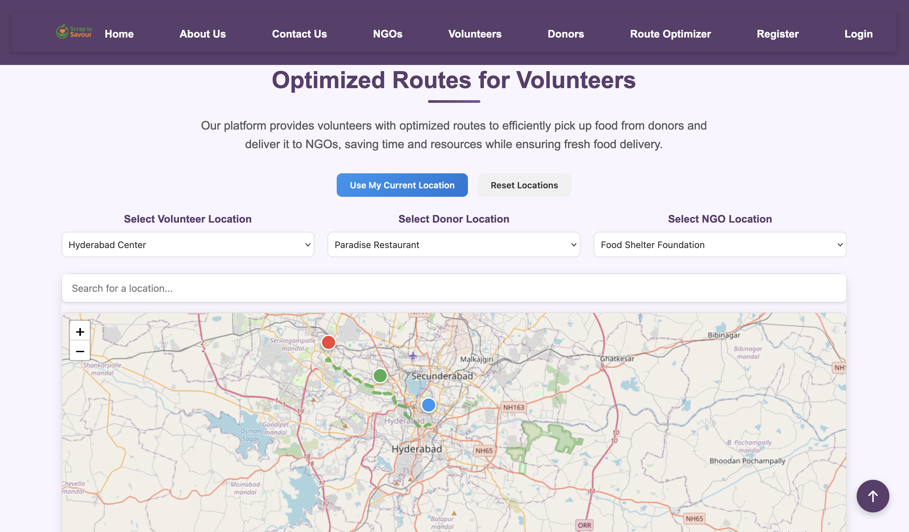
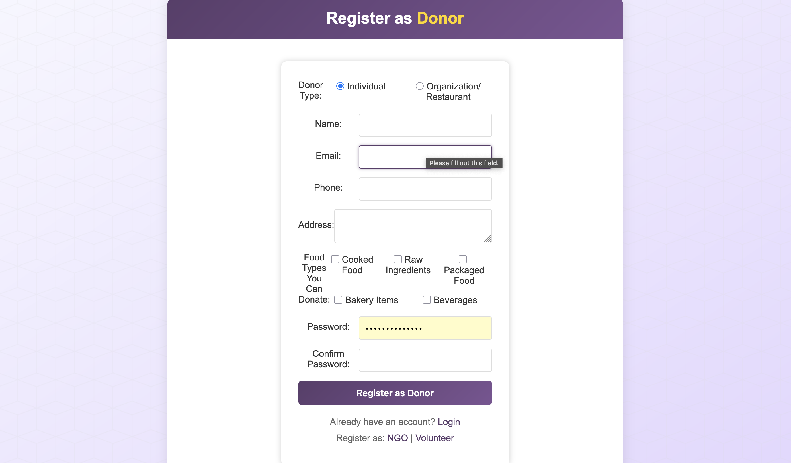

# 🥗 Scrap-to-Savor

A **Crowdsourced Food Waste Reduction Platform** that connects food donors, NGOs, and volunteers to collect and distribute excess food using **AI-powered route optimization**.

---

## 🚀 Features

### 👨‍🍳 Donor Module

- Add food donation requests with details (quantity, expiry, location)
- AI model accepts/rejects food based on spoilage prediction
- Past donation history view

### 🏢 NGO Module

- NGO registration and login
- Add and manage volunteers

### 🧍 Volunteer Module

- View nearby donors
- Route optimization using Google Maps API + AI
- Choose nearest donor locations

### 🌍 General

- Firebase Authentication
- Google Maps Integration
- Responsive UI with Tailwind CSS
- Real-time database using Firebase

---

## 🖼️ Screenshots

> 📌 _Place all images inside a `screenshots/` folder and update the image paths if needed._

### 🏠 Home Page


### 📖 About Us


### 🏢 NGO Dashboard


### 🙋 Volunteer Dashboard


### 🍱 Donor Dashboard


### 📍 Volunteer Route Optimization



### 📞 Contact Page


### 📝 NGO Registration


### 📝 Volunteer Registration


### 📝 Donor Registration



---

## 🛠️ Tech Stack

| Frontend   | Backend      | AI Tools           | Other Tools     |
| ---------- | ------------ | ------------------ | --------------- |
| React.js   | Firebase     | Scikit-Optimizer   | Google Maps API |
| HTML, CSS  | Firestore DB | Dijkstra Algorithm | Tailwind CSS    |
| JavaScript |              |                    | Figma           |

---

## 📦 Local Setup

```bash
git clone https://github.com/your-username/scrap-to-savor.git
cd scrap-to-savor
npm install
npm start
```
